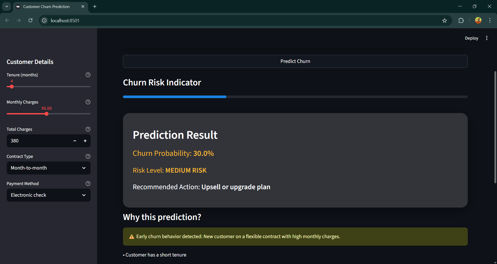
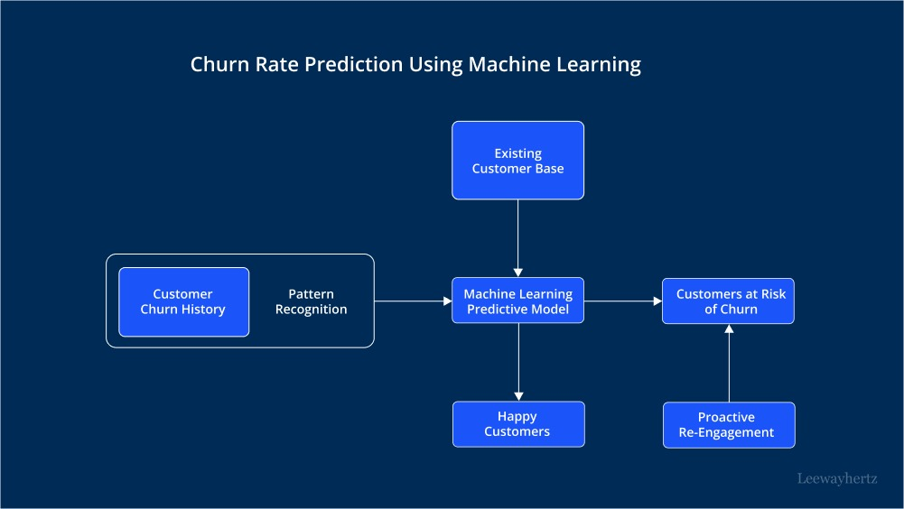

# Customer Churn Prediction System

## Problem Statement
Customer churn occurs when customers stop using a company’s product or service.  
For subscription-based businesses, retaining existing customers is more cost-effective than acquiring new customers.

This project focuses on predicting customer churn in advance using machine learning so that businesses can take proactive retention actions.

---

## Objective
- Predict the probability of customer churn  
- Classify customers into **Low / Medium / High risk** categories  
- Provide actionable business recommendations  
- Deliver predictions through an interactive web application  

---

## Dataset Description
- Dataset: **Telco Customer Churn Dataset**
- Data Type: Structured tabular data
- Target Variable: `Churn` (Yes / No)

### Key Features Used:
- `tenure` – Number of months the customer has stayed
- `MonthlyCharges` – Monthly billing amount
- `TotalCharges` – Total amount billed to the customer
- `Contract` – Contract type
- `PaymentMethod` – Payment mode

---

## Tech Stack
- **Programming Language:** Python  
- **Frontend:** Streamlit  
- **Backend:** Python  
- **Machine Learning:** Scikit-learn  
- **Model Used:** Random Forest Classifier  
- **Data Processing:** Pandas, NumPy  

---

---
## Customer Churn Prediction – Folder Structure

```text
customer-churn-prediction/
├── data/
│   ├── raw/                # Original dataset files
│   └── processed/          # Cleaned and preprocessed data
├── notebooks/
│   ├── eda.ipynb           # Exploratory Data Analysis
│   └── experiments.ipynb  # Model experiments
├── src/
│   ├── preprocessing.py   # Data cleaning & preprocessing
│   ├── features.py        # Feature engineering
│   ├── train.py           # Model training
│   ├── predict.py         # Prediction logic
│   └── utils.py           # Helper functions
├── models/
│   └── churn_model.pkl    # Trained ML model
├── results/
│   ├── metrics.json       # Evaluation metrics
│   └── plots/             # Accuracy, ROC, confusion matrix
├── assets/
│   └── screenshots/       # UI / result screenshots (portfolio use)
├── app.py                 # Streamlit / Flask app (optional)
├── requirements.txt       # Project dependencies
└── README.md              # Project documentation
```
---

## Machine Learning Workflow

### 1️⃣ Data Preprocessing
- Handled missing values  
- Encoded categorical variables using One-Hot Encoding  
- Selected relevant features  
- Split data into training and testing sets  

---

### 2️⃣ Model Training
- Algorithm: **Random Forest Classifier**
- Reason for selection:
  - Handles non-linear relationships
  - Robust to noise
  - Performs well on structured datasets

The model learns historical customer behavior patterns that lead to churn.

---

### 3️⃣ Model Prediction
- Outputs **churn probability** instead of only Yes/No
- Probability range: `0 → 1`
- Higher value indicates higher churn likelihood

---

## End-to-End Working Flow

This section explains how data flows from the user interface to the machine learning model.

### Step 1: User Input (Frontend)
The user enters customer details through the Streamlit sidebar:
- Tenure
- Monthly Charges
- Total Charges
- Contract Type
- Payment Method

---

### Step 2: Backend Processing
After clicking **Predict Churn**:
1. Inputs are collected from the UI  
2. Categorical values are encoded  
3. Input features are aligned with the trained model  
4. Missing features are filled with zero  

---

### Step 3: Model Execution
- Processed input is passed to the trained Random Forest model  
- The model computes the churn probability  
- Prediction result is returned to the application  

---

### Step 4: Business Logic Layer
- Business-adjusted thresholds are applied  
- Customers are classified into:
  - **LOW RISK**
  - **MEDIUM RISK**
  - **HIGH RISK**
- Early churn behavior is detected using rule-based logic  

---

### Step 5: Output & Recommendation
The application displays:
- Churn probability (%)
- Risk level
- Recommended retention action
- Explanation of why the customer is at risk

---

## Churn Risk Classification Logic

| Churn Probability | Risk Level |
|------------------|-----------|
| < 30% | LOW RISK |
| 30% – 59% | MEDIUM RISK |
| ≥ 60% | HIGH RISK |

> Note: Random Forest probabilities are conservative, so business-driven thresholds are applied.

---

## Application Features
- Interactive Streamlit interface  
- Real-time churn prediction  
- Risk visualization using progress indicators  
- Business-friendly action recommendations  
- Modular and scalable architecture  

---

## Application Output

### 🔹 Churn Prediction Result
The image below shows the churn probability, risk level, and recommended action generated by the system.



---

### 🔹 System Flowchart
The flowchart below illustrates the complete system workflow from user input to churn prediction and recommendation.



---

## Flowchart Explanation
1. User enters customer details  
2. Backend preprocesses the input data  
3. Encoded data is passed to the ML model  
4. Model predicts churn probability  
5. Business logic determines risk level  
6. Retention recommendation is displayed  

This ensures a clear separation between UI, backend logic, and machine learning components.

---

## How to Run the Project Locally

```bash
git clone https://github.com/your-username/customer-churn-prediction.git
cd customer-churn-prediction
pip install -r requirements.txt
streamlit run app.py
```

## Author
**Elango E**  
AI & Machine Learning Enthusiast  
Customer Churn Prediction | End-to-End ML Application

## Deployed Link
https://elango74-customer-churn-prediction-streamlit-appapp-5zgxqf.streamlit.app/
